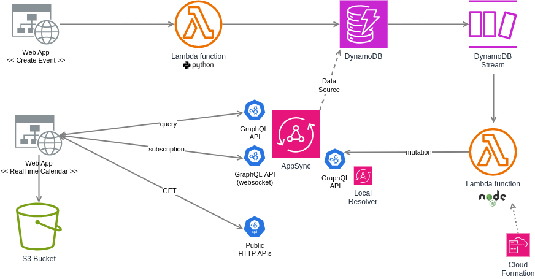

# 2_realtime_agenda

Second project : exploring additional services and deepening my understanding of AWS by making a realtime updated calendar using DynamoDB, GraphQL websockets (AWS AppSync), Javascript SDK, cli, Lambda, CloudFormation... For learning purposes, this is an app with several modules because I wanted to explore various services in 1 go. Obviously, it's possible to simplify this app to a webapp with a graphql server.

Resources were mostly deployed using AWS Management Console. Some resources were deployed using CloudFormation for a learning purpose.

Target process :
- a calendar event is created in Create Event webapp
- it triggers a Python Lambda creating the event in DynamoDB database
- DynamoDB streams trigger the execution of a NodeJS Lambda to convey the database changes in AppSync (with a dedicated mutation having Local Resolvers)
- through the GraphQL websocket, the new event is pushed to a second webapp RealTime Calendar

# Architecture



# Notes

## DynamoDB 
Create table using these commands
```
aws dynamodb create-table \
--table-name events_table \
--attribute-definitions \
AttributeName=user_id,AttributeType=N AttributeName=id,AttributeType=N \
--key-schema \
AttributeName=user_id,KeyType=HASH AttributeName=id,KeyType=RANGE \
--provisioned-throughput \
ReadCapacityUnits=5,WriteCapacityUnits=5

/// Wait a few seconds for table to be ready

aws dynamodb batch-write-item --request-items file://dynamo_db/load_db_data.json
```

In Table > Exports and Streams > DynamoDB stream details, turn on stream feature.

## AppSync

Subscription to get real time updates of new data is supported in AppSync when data is updated through a GraphQL mutation. However, if the underlying data source (in this case : DynamoDB) gets updated, the subscription is not updated natively in AWS AppSync. So it is necessary to put up a special mechanism to propagate the database changes to AppSync.
Therefore a specific mutation with Local Resolvers is required. DynamoDB Streams capture changes in the table, they trigger an AWS Lambda, which invokes this mutation.

Create AppSync API, using GraphQL type, with DynamoDB data source. Based on the DyanmoDB table data, AppSync automatically creates a GraphQL schema.

Generate an API key in Settings > Default authorization mode, and test AppSync using curl
```
curl -X POST \
-H "x-api-key: {AppSync api key}" \
-H "Content-Type: application/json" \
-d '{"query": "query listEventsTables { \n  listEventsTables {  items { id dt_start } } \n }"}' \
{AppSync GraphQL endpoint}.appsync-api.us-east-1.amazonaws.com/graphql

Response :
{"data":{"listEventsTables":{"items":[{"id":5,"dt_start":"2024-02-02T20:00:00"},{"id":1,"dt_start":"2024-02-01T09:00:00"},{"id":2,"dt_start":"2024-02-01T12:00:00"},{"id":3,"dt_start":"2024-02-01T10:00:00"},{"id":4,"dt_start":"2024-02-02T20:00:00"}]}}}
```

### Create Event webapp

Simple vanilla js webapp to create an event. It invokes lambda_function_dynamodb by using Function URL. API request with authorization (AWS_IAM) to invoke the Lambda is done through AWS SDK for Javascript.

### Realtime Calendar webapp

Simple vanilla js webapp to display events in realtime.

It relies on 3 different APIs :
- AppSync GraphQL : request user events at page load
- AppSync GraphQL realtime endpoint : websocket connection to retrieve user events added in real time
- public rest API Nager.Date : include holidays in the calendar

It doesn't use AWS SDK, because authentication is done using api_key (not perfect).

### Sources
https://github.com/aws-samples/serverless-patterns/tree/main/dynamodb-streams-appsync-subscription

https://docs.aws.amazon.com/appsync/latest/devguide/aws-appsync-real-time-data.html

